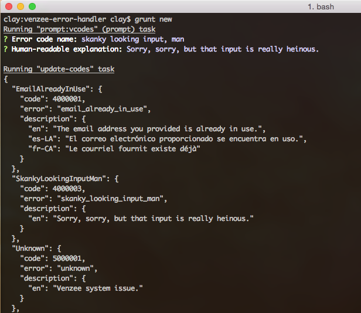

# venzee-errors

Generates Venzee-specific Error objects, and converts those that are less endowed to the Venzee Error Hotness.

## Installation

```sh
$ npm install venzee/venzee-errors --save
```

## Usage

Generate a Venzee Error from scratch, based on the defined error codes in this package.

```js
'use strict';
var util = require('util');
var venzeeError = require('venzee-errors');
var E = venzeeError.E;

var err = venzeeError(E.USERNAME_UNAVAILABLE);
if (util.isError(err)) {
  console.log('util.isError calls this an bona-fide error!');
}

// look at the error like an error response payload
console.log(JSON.stringify(err.toBody(), null, 2));
```

**Output**

```json
{
  "error": {
    "name": "UsernameUnavailable",
    "message": "The username you requested is unavailable.",
    "@context": "/contexts/Error.jsonld",
    "@id": "/errors/UsernameUnavailableError",
    "code": 4000002,
    "statusDescription": "Conflict",
    "status": 409,
    "statusCode": 409
  }
}
```

## What about complex errors?

We retain all that, while adding our sugar. A regular JSON representation of a `loopback-datasource-juggler` ValidationError looks like this:

```json
{
  "error": {
    "name": "ValidationError",
    "message": "The `user` instance is not valid. Details: `firstName` can't be blank; `lastName` can't be blank.",
    "statusCode": 422,
    "details": {
      "context": "user",
      "codes": {
        "firstName": [
          "presence"
        ],
        "lastName": [
          "presence"
        ]
      },
      "messages": {
        "firstName": [
          "can't be blank"
        ],
        "lastName": [
          "can't be blank"
        ]
      }
    }
  }
}
```

Process that error as a Venzee Error, and you get this:

```js
var err = venzeeError(e);
console.log(JSON.stringify(err.toBody(), null, 2));
```

**Output:**

```json
{
  "error": {
    "name": "ValidationError",
    "message": "The `user` instance is not valid. Details: `firstName` can't be blank; `lastName` can't be blank.",
    "@context": "/contexts/Error.jsonld",
    "@id": "/errors/ValidationError",
    "code": 4004220,
    "statusDescription": "Unprocessable Entity",
    "status": 422,
    "statusCode": 422,
    "details": {
      "context": "user",
      "codes": {
        "firstName": [
          "presence"
        ],
        "lastName": [
          "presence"
        ]
      },
      "messages": {
        "firstName": [
          "can't be blank"
        ],
        "lastName": [
          "can't be blank"
        ]
      }
    }
  }
}
```

A few more examples await you in `example.js`!


-----
### Adding new error codes

```sh
$ grunt new (Deprecated, please don't use it and follow the generating the error code from scratch above mamually)
```

You'll be prompted for an error code string, and a human-friendly message. The code will be added to `lib/codes.json`, with the next-available 400* series code number.



#### Options

##### logger

Type: `String` _optional_

Default: `venzee-logger`

Name of a logging module to use internally. For example, a value of `winston` will load the winston log package.

#### codes

Type: `String` _optional_

Default: `./codes.json` _codes.json from inside `lib` directory_

File path to your own custom error codes.

#### Reference
http status code: http://www.restapitutorial.com/httpstatuscodes.html


